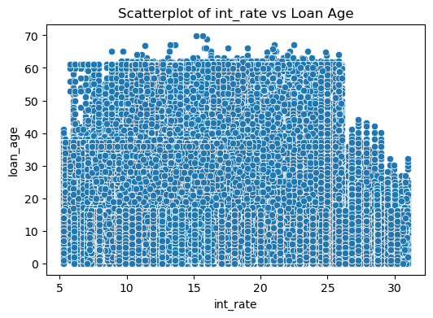
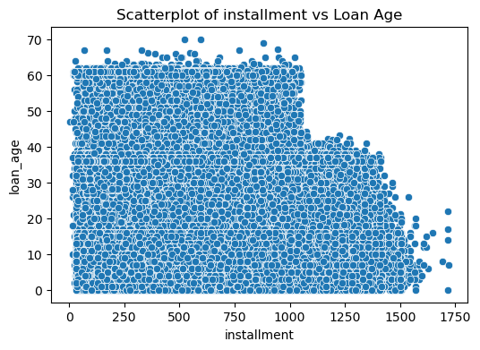
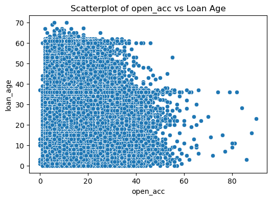
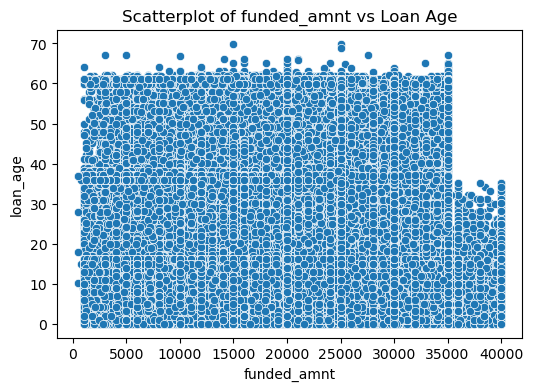
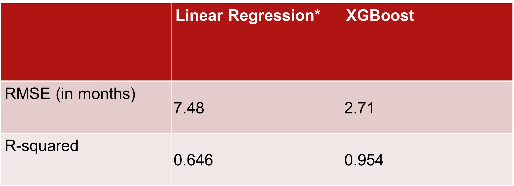

# DS_Final_Project_Loan_Prepayment_Prediction

# Objectives
Predict the age of loans to better understand early prepayment patterns and borrower behavior.

# Why It Matters
Helps lenders anticipate borrower behavior.
Supports risk management.
Improves prepayment forecasting.

# Data Source and Variables
Lending Club (from Kaggle).
Target Variable - Loan age.
Key Features - Loan amount, installment, total payment, last payment amount, purpose, home ownership, open accounts. 

# Data Prep and Feature Engineering
Handled missing values.
Feature engineering: 
Engineered loan age = last payment date – issue date  and filtered out all paid out loans in number of months.
Encoded categorical variables.

# Exploratory Data Analysis
some of the relationships shown in the the notebook:
 
 
 

# Results

# Interpretation
Last payment amount the only variable with strong correlation with the loan age. 
All features except three mentioned in the previous slide are highly significant.
Insight:
Negative relationship: loan amount, interest rate, monthly installment, annual income, accounts open, purpose
Positive relationship: home ownership.

# Challenges and Future Works
## Challenges:
Limited datasets.
Runtime.
## Future Work:
Consider time series analysis and extend model to include macroeconomic indicators.
Deploy as a web app for real-time prediction to be used by underwriters.
Combine with prepayment prediction for end-to-end forecasting.

